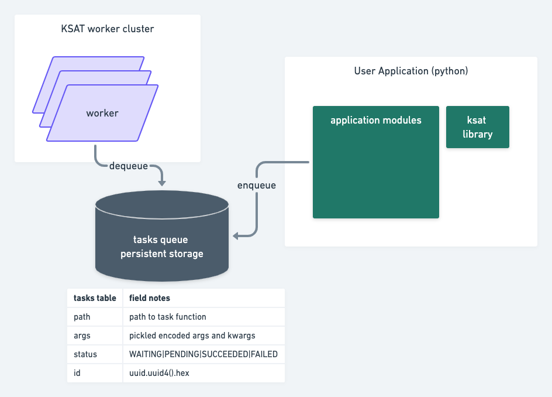

# ksat

KSAT is a simple asynchronous job scheduling solution for python applications.
It allows to delegate long running functions to be done as tasks by another cluster.

# Architecture


# Usage
```python
# From the application library
from ksat import task

@task
def hard_func(args):
    # ideally, this function has no return function and is idempotent
    result = compute_expensive_thing(args)
    log_result(result)
```

For now, ksat does not support return values. We are still debating how we want to handle the syntax for those.


# Development

You will need to install `pip install dev-requirements.txt`
We use [pytest](https://docs.pytest.org/), and you can run all tests by simply calling:
```
$ pytest
```
